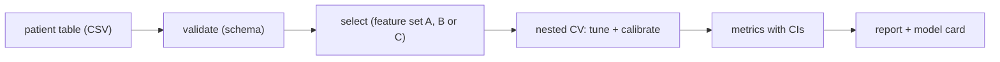
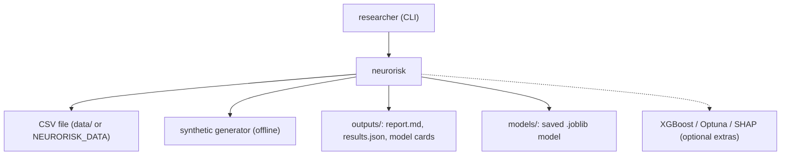
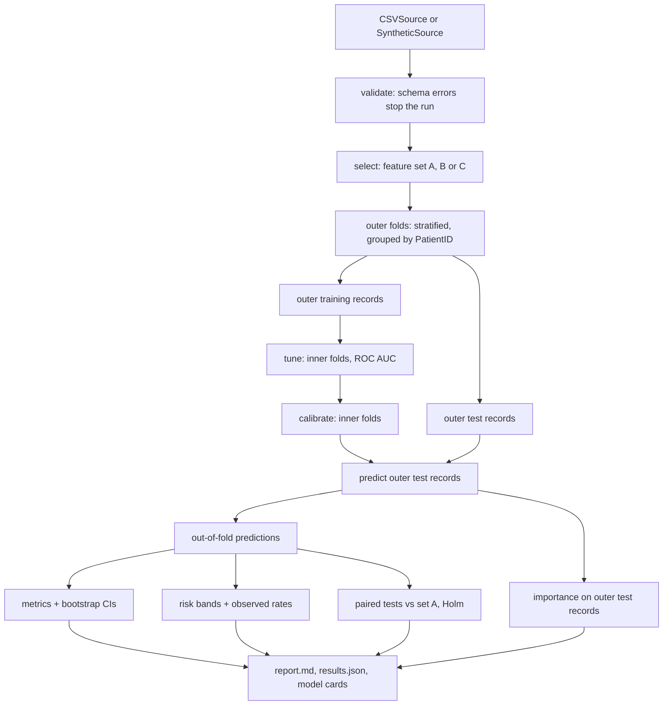

<div align="center">

# neurorisk — Leakage-Safe Alzheimer's Risk Models

**neurorisk is a research toolkit for tabular Alzheimer's risk models with honest feature sets. It takes a patient table through these steps to calibrated risk and a report:**

`validate` → `select` → `tune` → `calibrate` → `evaluate` → `report`.


**[Summary](#1-summary)** ·
**[Workflow](#4-the-end-to-end-workflow)** ·
**[Run it](#10-how-to-run-neurorisk)** ·
**[Configuration](#104-environment-variables)** ·
**[Known problems](#13-known-problems)** ·
**[Glossary](#15-glossary)**

</div>

> [!NOTE]
> This README uses ASD-STE100 Simplified Technical English. The writing rules and the project
> vocabulary are in [`docs/ste-style-guide.md`](docs/ste-style-guide.md). Each term in the
> [Glossary](#15-glossary) has only one meaning.

---

neurorisk asks one question: do cardiometabolic factors alone predict an Alzheimer's label in a tabular dataset? It keeps that question separate from the easy question. Symptoms and cognitive tests describe the disease itself, so neurorisk puts them only in a ceiling set. Each number comes from nested CV with confidence intervals, and the risk is a calibrated probability.

This README is the **one location that explains all of neurorisk**. It gives these topics:

- the general design
- each component and its procedure, step by step
- the decision rules
- the data map
- the runbook
- the validation results and the known problems

| If you are… | Read |
|---|---|
| A manager or reviewer | [1](#1-summary), [3](#3-design-rules), [4](#4-the-end-to-end-workflow), [12](#12-validation-results), [14](#14-key-points) |
| A developer who joins the project | All sections, in sequence. Keep [10](#10-how-to-run-neurorisk) and [13](#13-known-problems) open while you work |
| An operator who runs neurorisk | [10](#10-how-to-run-neurorisk), then the section for the component that you use |

> [!WARNING]
> Do not use neurorisk for medical decisions. It is a research and teaching tool, not a diagnostic tool or a screening tool. The public dataset is synthetic.

---

## Table of contents

1. 🧭 [Summary](#1-summary)
2. 🏗️ [How neurorisk is built](#2-how-neurorisk-is-built)
   - 2.1 [Components](#21-components)
   - 2.2 [System context](#22-system-context)
   - 2.3 [Repository layout](#23-repository-layout)
3. 🛡️ [Design rules](#3-design-rules)
4. 🔄 [The end-to-end workflow](#4-the-end-to-end-workflow)
   - 4.1 [Full flow](#41-full-flow)
   - 4.2 [The life cycle of one record](#42-the-life-cycle-of-one-record)
5. 🔵 [The data contract and the feature sets](#5-the-data-contract-and-the-feature-sets)
6. 🟢 [The model pipelines and nested CV](#6-the-model-pipelines-and-nested-cv)
7. 🟣 [Calibration, risk and importance](#7-calibration-risk-and-importance)
8. ⚖️ [The metrics and the statistical rules](#8-the-metrics-and-the-statistical-rules)
9. 🗂️ [Data and file map](#9-data-and-file-map)
10. ▶️ [How to run neurorisk](#10-how-to-run-neurorisk)
    - 10.1 [Prerequisites](#101-prerequisites) · 10.2 [Installation](#102-installation) · 10.3 [Run neurorisk](#103-run-neurorisk) · 10.4 [Environment variables](#104-environment-variables)
11. 🧩 [How to extend neurorisk](#11-how-to-extend-neurorisk)
12. ✅ [Validation results](#12-validation-results)
13. ⚠️ [Known problems](#13-known-problems)
14. 📌 [Key points](#14-key-points)
15. 📖 [Glossary](#15-glossary)
16. 📄 [License](#16-license)

---

## 1. Summary

**The problem.** A model with about 95% accuracy on this dataset looks strong. But most of the signal comes from symptoms of the disease. These questions are difficult:

- Which part of the score comes from risk factors, and which part comes from symptoms?
- Is the test result free of tuning leakage?
- Is a "high risk" label backed by an observed event rate?
- Is a difference between two models larger than the noise?

neurorisk gives each of these questions its own component. The feature sets separate risk factors from symptoms, nested CV isolates tuning, calibration turns scores into risk, and paired bootstrap tests measure the differences.

| Item | Value |
|---|---|
| Input | A CSV table with one record per patient and the 35 columns of the schema |
| Output | `report.md`, `results.json`, one model card per model, a saved model (`.joblib`) and a predictions CSV |
| Components | **15** modules: config, schema, features, data, synthetic, models, tuning, nested_cv, metrics, risk, explain, stats, report, training, cli |
| Providers | None required. XGBoost, Optuna and SHAP are optional extras |
| Offline mode | All commands. The synthetic generator replaces the download |
| Safety | Model inputs come only from a feature-set whitelist. Tuning and calibration see only outer training records |
| Tests | **72** unit tests (`pytest`): 71 pass, 1 skips without the `xgboost` extra |



---

## 2. How neurorisk is built

### 2.1 Components

| Component | Module | Purpose |
|---|---|---|
| Settings | `src/neurorisk/config.py` | Read `NEURORISK_*` variables and a local `.env` file. Reject invalid values |
| Schema | `src/neurorisk/schema.py` | Column contract: names, kinds, ranges, permitted values. The validator |
| Feature sets | `src/neurorisk/features.py`, `configs/feature_sets.json` | Whitelists A, B and C with domains. `select` copies only the listed columns |
| Data sources | `src/neurorisk/data.py` | `CSVSource` and `SyntheticSource` behind one `DataSource` interface. Load, validate and hash |
| Generator | `src/neurorisk/synthetic.py` | Schema-valid synthetic records with a weak risk-factor signal and a strong symptom signal |
| Pipelines | `src/neurorisk/models.py` | Imputation, scaling and one-hot encoding inside a scikit-learn `Pipeline`. Six models |
| Tuner | `src/neurorisk/tuning.py` | Grid search (default) or Optuna (extra) on inner folds |
| Nested CV | `src/neurorisk/nested_cv.py` | Outer folds grouped by patient. Tune, calibrate and predict per outer fold |
| Metrics | `src/neurorisk/metrics.py` | AUROC, AUPRC, Brier, log loss, ECE, calibration slope, bootstrap CIs, paired tests, Holm, BH, decision curve |
| Risk bands | `src/neurorisk/risk.py` | Labels on the calibrated probability, with the observed rate per band |
| Importance | `src/neurorisk/explain.py` | Grouped and single-feature permutation importance on held-out records. SHAP as an extra |
| Group statistics | `src/neurorisk/stats.py` | Mann-Whitney tests on raw features only, with effect sizes and adjusted p-values |
| Report | `src/neurorisk/report.py` | `results.json`, `report.md` and model cards |
| Final model | `src/neurorisk/training.py` | Fit, save and load one calibrated model. Predict risk and risk bands |
| CLI | `src/neurorisk/cli.py` | The `neurorisk` command with 8 subcommands |

### 2.2 System context



### 2.3 Repository layout

```
neurorisk/
├── src/neurorisk/          the package (15 modules)
│   └── configs/            feature_sets.json: the A, B and C whitelists
├── tests/                  72 pytest tests, synthetic data only
├── data/README.md          dataset source, license, columns and download steps
├── docs/ste-style-guide.md writing rules and project vocabulary
├── .github/workflows/      ci.yml: pytest on Python 3.11
├── .env.example            names of the environment variables
└── pyproject.toml          package, extras and the neurorisk entry point
```

---

## 3. Design rules

### 3.1 One research question per feature set
Feature set `A` contains only cardiometabolic features and gives the main result. Set `B` adds demographics, lifestyle and history. Set `C` adds cognitive tests and symptoms, so its score is a ceiling. The report prints the role of each set next to its numbers.

### 3.2 A whitelist for model inputs
`features.select` copies only the columns of the feature set. A column that a caller adds to the table, for example an old risk score, cannot reach a model. The feature-set parser rejects the ID, the label, `DoctorInCharge` and any column that is not in the schema.

### 3.3 Measurement records never touch tuning
`nested_cv.run_nested_cv` gives only the outer training records to the tuner and to the calibrator. The outer test records get one out-of-fold prediction each. A test checks that the tuner never receives an outer test record.

### 3.4 The pipeline owns all preprocessing
Imputation, scaling and one-hot encoding are steps of one scikit-learn `Pipeline`. They fit on the training records of each fold only. Scaling removes the effect of units, so cholesterol values do not dominate binary flags.

### 3.5 Risk is a calibrated probability
The risk of a record is the output of `CalibratedClassifierCV` (sigmoid or isotonic). A risk band is a label on that probability. The report shows the observed rate of each band, so each label has evidence.

### 3.6 Every estimate has an interval
`metrics.bootstrap_ci` gives a 95% stratified bootstrap interval for each metric. `metrics.paired_bootstrap` compares two feature sets on the same records. The Holm method adjusts the p-values for many comparisons.

### 3.7 Statistics use raw features only
`stats.compare_groups` refuses any column that is not a raw schema feature. This rule prevents circular tests of label-weighted scores. The output gives effect sizes and Holm and Benjamini-Hochberg adjusted p-values.

### 3.8 Seeded and reproducible runs
The seed controls the splits, the models, the bootstrap and the permutations. The report records the data hash, the settings and the package version. Two runs with the same seed and data give the same predictions.

---

## 4. The end-to-end workflow

### 4.1 Full flow



### 4.2 The life cycle of one record

1. The data source reads the record from the CSV file or from the generator.
2. The validator checks each value against the schema range and the permitted values.
3. `select` keeps only the features of the chosen feature set.
4. The outer split puts the record, and all other records of the same patient, in one outer test fold.
5. In the other folds, the record helps to tune, calibrate and fit the model.
6. In its own fold, a model that did not see the record predicts its risk.
7. The risk band function gives the record a band label.
8. The metrics, the band table and the decision curve include the out-of-fold prediction of the record.

---

## 5. The data contract and the feature sets

**Purpose.** Stop invalid data before a model sees it, and fix the model inputs for each research question.

| Input | Output |
|---|---|
| A CSV table (or synthetic records) | A validated `Dataset` (frame, report, source, SHA-256), and the feature columns of one feature set |

**Procedure**

1. Read the table with a `DataSource`.
2. Check that the 34 required columns exist. `DoctorInCharge` is optional and ignored.
3. Check that each value is numeric, inside its range and inside its permitted set.
4. Stop with a `SchemaError` if any error exists. Print warnings for missing feature values and unknown columns.
5. Coerce the types, reset the index and compute the SHA-256 hash of the table.
6. Copy the columns of the chosen feature set with `select`.

**Rules**

- A missing label, a missing ID, an out-of-range value or a single label class is an error.
- A missing feature value is a warning. The pipeline imputes it on training records only.
- A repeated `PatientID` is a warning. The grouped split keeps all records of that patient in one fold.

| Feature set | Role | Domains | Features |
|---|---|---|---|
| `A` | main | cardiovascular, metabolic | 11 |
| `B` | adjusted | A + demographic, lifestyle, history | 22 |
| `C` | ceiling | B + cognitive_functional, symptoms | 32 |

| Domain | Features |
|---|---|
| `cardiovascular` | `SystolicBP`, `DiastolicBP`, `Hypertension`, `CardiovascularDisease`, `Smoking` |
| `metabolic` | `BMI`, `Diabetes`, `CholesterolTotal`, `CholesterolLDL`, `CholesterolHDL`, `CholesterolTriglycerides` |
| `demographic` | `Age`, `Gender`, `Ethnicity`, `EducationLevel` |
| `lifestyle` | `AlcoholConsumption`, `PhysicalActivity`, `DietQuality`, `SleepQuality` |
| `history` | `FamilyHistoryAlzheimers`, `Depression`, `HeadInjury` |
| `cognitive_functional` | `MMSE`, `FunctionalAssessment`, `ADL` |
| `symptoms` | `MemoryComplaints`, `BehavioralProblems`, `Confusion`, `Disorientation`, `PersonalityChanges`, `DifficultyCompletingTasks`, `Forgetfulness` |

---

## 6. The model pipelines and nested CV

**Purpose.** Measure each model on records that its tuning and calibration did not see.

| Input | Output |
|---|---|
| A `Dataset`, a feature set, a model name and `Settings` | A `NestedCVResult`: one out-of-fold prediction per record, and per-fold parameters and importance |

**Procedure**

1. Build the pipeline: imputation, scaling, one-hot encoding of `Ethnicity`, then the model.
2. Split the records into outer folds with `StratifiedGroupKFold` (label-stratified, grouped by `PatientID`).
3. For each outer fold, tune the hyperparameters with inner folds on the outer training records.
4. Fit `CalibratedClassifierCV` with inner folds on the same outer training records.
5. Predict the outer test records and store the out-of-fold predictions.
6. If `--explain` is on, compute importance on the outer test records.

**Rules**

- The `prior` baseline has no tuning and no calibration. It predicts the training prevalence.
- Grid search scores ROC AUC. The Optuna backend samples the same grid.
- `train` fits a final model on all records. It has no held-out estimate, so performance numbers come only from `evaluate` and `compare`.

| Model | Description | Tuning grid |
|---|---|---|
| `prior` | Baseline: training prevalence | none |
| `logreg` | L2 logistic regression | `C` in 0.01, 0.1, 1, 10 |
| `rf` | Random forest, 300 trees | `max_depth` None or 6, `max_features` sqrt or 0.5 |
| `hgb` | Histogram gradient boosting | `learning_rate` 0.03 or 0.1, `max_depth` 3 or None |
| `xgb` | XGBoost (extra `xgboost`) | `max_depth` 2 or 4, `learning_rate` 0.03 or 0.1 |
| `stack` | logreg + rf + hgb, logistic meta-model | none |

---

## 7. Calibration, risk and importance

**Purpose.** Give a risk value with a probabilistic meaning, and show which domains a model uses.

| Input | Output |
|---|---|
| Out-of-fold predictions and the outer test records | Risk bands with observed rates, a calibration table, domain and feature importance |

**Procedure**

1. Calibrate each tuned pipeline with inner folds (`sigmoid` by default, `isotonic` as an option).
2. Assign a risk band to each risk value with the cut-offs in `NEURORISK_RISK_BANDS`.
3. For each band, count the records and compute the mean risk and the observed rate.
4. For importance, shuffle all features of one domain together with one row permutation.
5. Record the drop of AUROC on the outer test records. Repeat and average over folds.

**Rules**

- The default cut-offs are 0.10, 0.30 and 0.60. They give the bands `low`, `moderate`, `elevated` and `high`.
- The cut-offs are labels for communication. They are not clinical thresholds.
- Importance shows what a model uses. It does not show a cause of the disease.

| Band | Risk range (default) |
|---|---|
| `low` | 0.00 to 0.10 |
| `moderate` | 0.10 to 0.30 |
| `elevated` | 0.30 to 0.60 |
| `high` | 0.60 to 1.00 |

---

## 8. The metrics and the statistical rules

| Metric | Meaning | Better |
|---|---|---|
| AUROC | Ranking quality over all thresholds | Higher (0.5 is chance) |
| AUPRC | Precision-recall area | Higher (the prevalence is chance) |
| Brier | Mean squared error of the risk | Lower |
| Log loss | Negative log likelihood of the risk | Lower |
| ECE | Expected calibration error, 10 equal-width bins | Lower |
| Calibration slope | Slope of the label on logit(risk) | Near 1 |
| Calibration intercept | Intercept of the same fit | Near 0 |
| Net benefit | Decision-curve value at thresholds 0.05, 0.1, 0.2, 0.3, 0.4 and 0.5 | Higher than `treat_all` and `treat_none` |

| Statistical rule | Value in the code |
|---|---|
| Confidence interval | 95% percentile, stratified bootstrap, `NEURORISK_BOOTSTRAP` resamples (default 1000) |
| Feature-set comparison | Paired bootstrap of the AUROC difference against the first set in `--feature-sets` |
| p-value | Two-sided bootstrap p-value, minimum 1 divided by the number of resamples |
| Multiple comparisons | Holm for feature-set comparisons. Holm and Benjamini-Hochberg for group statistics |
| Group statistics | Mann-Whitney U on raw features, rank-biserial effect size |

---

## 9. Data and file map

| Path | Committed? | Contents |
|---|---|---|
| `src/neurorisk/configs/feature_sets.json` | Yes | The A, B and C whitelists and their domains |
| `data/README.md` | Yes | Source, license, columns and download steps |
| `data/*.csv` | No (git ignores it) | The downloaded dataset or a synthetic table |
| `outputs/report.md` | No (git ignores it) | The comparison report |
| `outputs/results.json` | No (git ignores it) | All metrics, tables, settings and the data hash |
| `outputs/model_card_<set>_<model>.md` | No (git ignores it) | One model card per evaluated model |
| `models/*.joblib` | No (git ignores it) | A saved final model with metadata |
| `.env` | No (git ignores it) | Local settings |

---

## 10. How to run neurorisk

### 10.1 Prerequisites

| Need | For |
|---|---|
| Python 3.11+ | All components |
| A Kaggle account | Only for the public dataset download (see [`data/README.md`](data/README.md)) |
| `xgboost`, `optuna`, `shap` | Only for the `xgb` model, the Optuna tuner and SHAP values |

### 10.2 Installation

```bash
git clone https://github.com/KrishnaAnnavaram/neurorisk.git
cd neurorisk
python -m venv .venv
. .venv/bin/activate            # Windows: .venv\Scripts\activate
pip install -e ".[dev]"         # add ",all" for xgboost, optuna and shap
```

### 10.3 Run neurorisk

```bash
# offline demo: synthetic data, sets A/B/C, logreg, importance, report in outputs/
neurorisk demo

# synthetic CSV and schema check
neurorisk synth --rows 2000 --seed 42 --out data/synthetic.csv
neurorisk validate --data data/synthetic.csv

# the public dataset (download it first, see data/README.md)
neurorisk validate --data data/alzheimers_disease_data.csv
neurorisk compare --data data/alzheimers_disease_data.csv --model logreg --explain --out outputs/logreg
neurorisk evaluate --data data/alzheimers_disease_data.csv --feature-set A --model hgb
neurorisk stats --data data/alzheimers_disease_data.csv

# final model and new predictions
neurorisk train --data data/alzheimers_disease_data.csv --feature-set A --model logreg --out models/a_logreg.joblib
neurorisk predict --model models/a_logreg.joblib --data new_patients.csv --out predictions.csv

pytest -q
```

| Command | What it does |
|---|---|
| `neurorisk demo` | Runs `compare` on synthetic data with sets A, B and C, `logreg`, importance and 300 bootstrap resamples |
| `neurorisk synth` | Writes a synthetic CSV (`--rows`, `--seed`, `--missing-rate`, `--out`) |
| `neurorisk validate` | Checks a CSV against the schema. Exit code 1 on errors. `--no-label` for files without `Diagnosis` |
| `neurorisk evaluate` | Nested CV for one feature set and one model. `--explain` adds importance |
| `neurorisk compare` | Nested CV for several feature sets, paired tests, report and model cards |
| `neurorisk train` | Fits and saves one calibrated model on all records |
| `neurorisk predict` | Writes `risk_probability` and `risk_band` for new records |
| `neurorisk stats` | Prints descriptive group statistics of raw features |

The `evaluate`, `compare`, `train`, `stats` and `demo` commands accept `--data`, `--synthetic-rows`, `--seed`, `--outer-folds`, `--inner-folds`, `--bootstrap`, `--calibration`, `--tuning` and `--bands`. A command-line value replaces the environment value.

### 10.4 Environment variables

| Variable | Used by | Meaning |
|---|---|---|
| `NEURORISK_DATA` | data | CSV path. If empty, the commands use synthetic records |
| `NEURORISK_OUTPUT_DIR` | report | Output folder of `compare` (default `outputs`) |
| `NEURORISK_SEED` | all | Random seed (default 42) |
| `NEURORISK_OUTER_FOLDS` | nested CV | Outer folds (default 5, minimum 2) |
| `NEURORISK_INNER_FOLDS` | tuner, calibration | Inner folds (default 3, minimum 2) |
| `NEURORISK_BOOTSTRAP` | metrics | Bootstrap resamples (default 1000, minimum 50) |
| `NEURORISK_PERMUTATION_REPEATS` | importance | Shuffles per domain or feature (default 10) |
| `NEURORISK_CALIBRATION` | calibration | `sigmoid` (default) or `isotonic` |
| `NEURORISK_TUNING` | tuner | `grid` (default) or `optuna` |
| `NEURORISK_OPTUNA_TRIALS` | tuner | Optuna trials per outer fold (default 20) |
| `NEURORISK_RISK_BANDS` | risk bands | Increasing cut-offs inside (0, 1) (default `0.1,0.3,0.6`) |

neurorisk uses no credentials. A local `.env` file is optional, and git ignores it.

---

## 11. How to extend neurorisk

| You want to… | Do this | Code change? |
|---|---|---|
| Test a new feature set | Add an entry to a JSON file with `extends` and `domains`. Pass it with `--feature-config` | No |
| Change the risk bands | Set `NEURORISK_RISK_BANDS` or `--bands` | No |
| Add a model | Add a `ModelSpec` with a factory and a grid to `MODELS` in `models.py` | Small |
| Read data from a database | Write a class with `name` and `read()` that returns a DataFrame (the `DataSource` interface) | Small |
| Validate on a real cohort | Map the cohort columns to the schema names, then run `validate` and `compare` | Small |
| Add subgroup metrics | Compute `metrics.summarize` per subgroup on the out-of-fold predictions | Yes |

---

## 12. Validation results

| Validation | Result | Command |
|---|---|---|
| Unit tests | **71 passed, 1 skipped** (the `xgboost` test skips without the extra, also in CI) | `pytest -q` |
| Offline demo, synthetic data, set A | AUROC 0.532 [0.504, 0.556], ECE 0.003 | `neurorisk demo` |
| Offline demo, synthetic data, set B | AUROC 0.619 [0.597, 0.642], ECE 0.025 | `neurorisk demo` |
| Offline demo, synthetic data, set C | AUROC 0.856 [0.839, 0.872], ECE 0.025 | `neurorisk demo` |
| Offline demo, synthetic data, C - A | AUROC difference +0.324 [+0.295, +0.355], Holm p 0.0133 | `neurorisk demo` |
| Public dataset (local run), set A, `logreg` | AUROC 0.498 [0.472, 0.523], Brier 0.229 | `neurorisk compare --data data/alzheimers_disease_data.csv --model logreg --explain` |
| Public dataset (local run), set B, `logreg` | AUROC 0.519 [0.493, 0.546], B - A +0.021 [-0.001, +0.044], Holm p 0.072 | same |
| Public dataset (local run), set C, `logreg` | AUROC 0.900 [0.885, 0.913], C - A +0.401 [+0.375, +0.428], Holm p 0.004 | same |
| Public dataset (local run), set A, `hgb` | AUROC 0.474 [0.448, 0.500] | `neurorisk compare --data data/alzheimers_disease_data.csv --model hgb` |
| Public dataset (local run), set B, `hgb` | AUROC 0.471 [0.443, 0.498] | same |
| Public dataset (local run), set C, `hgb` | AUROC 0.950 [0.937, 0.963], ECE 0.035 | same |

The public-dataset rows come from one local run on the 2,149-record Kaggle table. The run used the default settings: 5 outer folds, 3 inner folds, seed 42 and 1000 bootstrap resamples. CI does not reproduce these rows, because git does not store the dataset.

**What the public-dataset numbers show.** The cardiometabolic set A is at chance level (AUROC near 0.5) with both models. The high scores come only with set C. In set C, `cognitive_functional` gives a mean AUROC drop of 0.279 and `symptoms` gives 0.133. The `cardiovascular` and `metabolic` domains give 0.001 each. Thus the dataset gives no evidence that cardiometabolic factors predict the label.

**What the synthetic numbers show.** The pipeline works end to end. It separates a weak risk-factor signal from a strong symptom signal. They do not describe real patients, because the generator makes the signal. The prototype reported about 95% accuracy with symptom features included (prototype result, not reproduced here).

---

## 13. Known problems

Read these problems before you use neurorisk in production.

| # | Area | Problem | Impact and action |
|---|---|---|---|
| 1 | Data | The public dataset is synthetic. | No clinical or biological conclusion follows. Validate on a real cohort under its data use agreement |
| 2 | CI | CI runs the tests on synthetic data only. | The public-dataset numbers are not reproduced in CI. Run `neurorisk compare` locally |
| 3 | Fairness | neurorisk does not report metrics per sex, ethnicity or age group. | Bias in the dataset can stay hidden. Add subgroup metrics before any use on people |
| 4 | Transfer | Calibration depends on the prevalence of the training data. | Recalibrate on the target population before you read a risk value |
| 5 | Importance | Permutation importance spreads credit over correlated features. | Read domain importance, not single-feature ranks, when features correlate |
| 6 | Runtime | `--explain` with many features and trees is slow (minutes). | Use fewer `NEURORISK_PERMUTATION_REPEATS` for a first run |
| 7 | Security | `predict` loads a `.joblib` file, and joblib can run code on load. | Load only model files that you made |
| 8 | Scope | The rebuild plan names SHAP per outer fold. neurorisk gives SHAP only as an optional helper. | Domain permutation importance is the tested attribution |

---

## 14. Key points

1. **Set A is the answer, set C is a ceiling.** Symptoms and cognitive tests describe the disease, so they never count as risk-factor evidence.
2. **Tuning never sees a measurement record.** Nested CV tunes and calibrates on outer training records only.
3. **Risk is a calibrated probability.** Each risk band shows its observed rate.
4. **Every number has an interval.** Bootstrap CIs, paired tests and Holm adjustment replace single-split comparisons.
5. **Model inputs come from a whitelist.** Derived columns cannot leak into a model.
6. **On the public dataset, set A is at chance level.** The local run gives AUROC 0.498 for `logreg` and 0.474 for `hgb`.
7. **This is not a medical tool.** A qualified clinician must review any decision about a person.

---

## 15. Glossary

| Term | Meaning |
|---|---|
| **AUROC** | Area under the ROC curve. The probability that a random case gets a higher risk than a random control |
| **Baseline** | The `prior` model. It gives the training prevalence to every record |
| **Ceiling set** | Feature set `C`. Its score is an upper limit, not a risk-factor result |
| **Domain** | A named group of features inside a feature set |
| **ECE** | Expected calibration error: the weighted mean gap between risk and observed rate per bin |
| **Feature set** | A named whitelist of features (`A`, `B` or `C`) |
| **Importance** | The mean drop of AUROC on held-out records when a feature or a domain is shuffled |
| **Inner fold** | A fold inside the outer training records. It tunes and calibrates |
| **Label** | The `Diagnosis` column (0 or 1) |
| **Model card** | A Markdown file with the intended use, data, inputs, performance and limits of one model |
| **Nested CV** | Outer folds for measurement with inner folds for tuning and calibration |
| **Observed rate** | The fraction of records with label 1 in a group |
| **Out-of-fold prediction** | The prediction for a record from the model that did not see that record |
| **Outer fold** | A part of the outer split. It measures the model |
| **Record** | One row of the table: the data of one patient |
| **Risk** | The calibrated probability of the label for one record |
| **Risk band** | A label for a range of risk: `low`, `moderate`, `elevated` or `high` |
| **Schema** | The column contract in `schema.py` |
| **Synthetic data** | Records that a generator made. They do not come from real patients |

---

## 16. License

[MIT](LICENSE) © 2026 Krishna Annavaram
